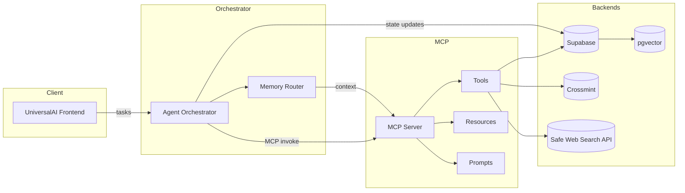
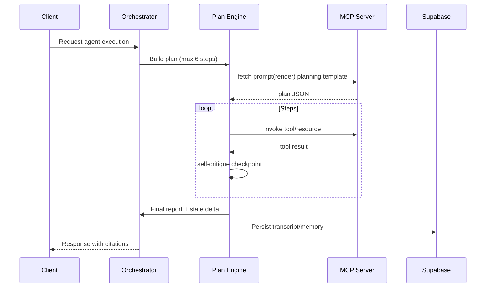
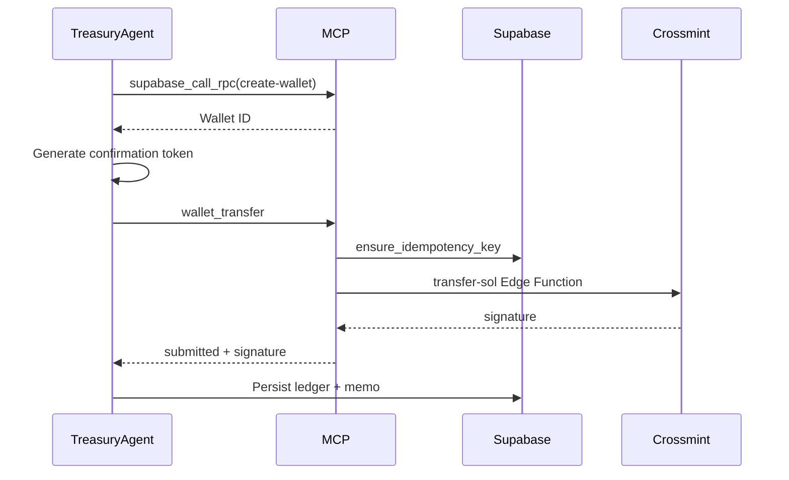
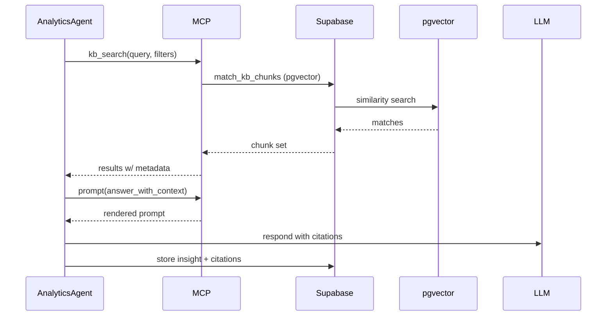

# UniversalAI Agent System Specification

## 1. Executive Summary
- **Goal:** Deliver a production-ready agent marketplace that orchestrates creator workflows across onboarding, asset production, rights management, treasury, analytics, and distribution.
- **Scope:** Unified orchestration via MCP tools, Supabase persistence, Crossmint wallets, and pgvector-backed retrieval for creator knowledge.
- **Constraints:** Node 18 runtime, React 18 frontend, Supabase multi-tenant schema, Solana-first wallets via Crossmint, rate limits (≤30 tool calls/task), token budgets (≤12k tokens/task), PII compliance, and deterministic idempotency for financial flows.
- **Key Risks:** Wallet fraud/abuse, pgvector drift, Supabase quota exhaustion, tool latency spikes, retrieval hallucinations, Crossmint outages.
- **KPIs:**
  - Task success rate ≥92% weekly moving average.
  - Tool error rate ≤3% per agent.
  - Mint/transfer success ≥98% confirmed submissions.
  - Cost ≤$0.35 average per orchestrated workflow.
  - p95 agent latency ≤22s end-to-end.

## 2. Architecture Overview
### Component Diagram


### Sequence: Agent Creation & Planning


### Sequence: Mint / Transfer Flow


### Sequence: RAG Answer with Citations


## 3. Agent Roster
| Agent | Intent(s) | Tools | Memory | Policies | SLO (p95) | Notes |
| --- | --- | --- | --- | --- | --- | --- |
| CreatorOnboardingAgent | Collect creator profile, wallet bootstrap | `supabase_query_sql`, `supabase_call_rpc`, `wallet_create`, `storage_put` | Short-term conversation, profile summary, long-term creator dossier | Must verify consent before storing PII; flag suspicious inputs | 18s | Escalate to human if KYC mismatch |
| StudioAgent (WZRD) | Ideation, asset generation orchestration | `storage_put`, `storage_get`, `kb_search`, `web_search` | Short-term plan, long-term project board + asset embeddings | Respect content safety filters, no NSFW outputs | 20s | Leverages creative model routing |
| RightsAgent | Manage collections, licensing | `supabase_query_sql`, `supabase_call_rpc`, `kb_search` | Contract library snapshots, licensing ledger | Enforce rights templates, require dual confirmation for rights revocation | 16s | Audit log to Supabase `rights_audit` |
| TreasuryAgent | Wallet ops, payouts | `wallet_create`, `wallet_transfer`, `supabase_call_rpc`, `supabase_query_sql` | Transaction history, treasury thresholds | Max 10 SOL/tx, confirmation token required, 4-eye review for >5 SOL | 15s | Runs mint_transaction_plan prompt for every mint |
| DistributionAgent | Social/community distribution scheduling | `storage_get`, `kb_search`, `web_search`, `supabase_call_rpc` | Campaign history, channel performance metrics | Comply with platform guidelines, throttle posts | 19s | Integrates analytics feedback loop |
| AnalyticsAgent | Insights & reporting | `supabase_query_sql`, `kb_search`, `web_search`, prompts | Aggregated metrics, trend store | Cite all metrics, anonymize PII | 14s | Pushes dashboards to Supabase storage |

## 4. Reasoning & Planning
- **Mode:** Plan-then-act with replan threshold (max 2 replans). Tool budget ≤10 per task.
- **Checkpoints:**
  - Pre-plan validation (inputs & policy).
  - Post-tool self-critique verifying tool success + hallucination guard.
  - Completion criteria: KPIs satisfied, outputs validated, citations attached.
- **Stop criteria:** Tool failures ≥3, policy violation detected, or cost >$0.50 estimate.
- **Fallback:** Switch to read-only mode using cached memories when Supabase degraded.

## 5. Memory & Retrieval
- **pgvector schema:**
```sql
create table if not exists agent_memory_chunks (
  id uuid primary key default gen_random_uuid(),
  creator_id uuid not null,
  agent_id text not null,
  chunk text not null,
  embedding vector(1536) not null,
  source_uri text,
  metadata jsonb default '{}'::jsonb,
  created_at timestamptz default now()
);
create index on agent_memory_chunks using ivfflat (embedding vector_cosine_ops) with (lists = 100);
create index on agent_memory_chunks (creator_id, agent_id, created_at desc);
```
- **Chunking:** 800-token overlap 150, summarise to 200 tokens for context lists. Metadata includes `intent`, `content_type`, `language`.
- **Citation policy:** Cite `source_uri` or generated storage path; fallback to `kb://` resource ID. Minimum 2 citations per insight.
- **Retention:** Short-term (conversation buffer) stored in orchestrator state; long-term via `agent_memory_chunks` with weekly pruning using embedding distance + recency.

## 6. Tooling & Integrations
- **Transport:** MCP HTTP JSON.
- **Auth:** Bearer token header + per-tool secrets (Supabase keys, Crossmint keys) loaded from env.
- **Retries:** Exponential backoff (250ms * 2^n, max 4) for idempotent tools; non-idempotent require manual confirmation.
- **JSON Schemas:** All tool inputs/outputs conform to draft 2020-12. Example (`wallet_transfer.input`):
```json
{
  "$schema": "https://json-schema.org/draft/2020-12/schema",
  "title": "wallet_transfer.input",
  "type": "object",
  "required": ["fromWallet", "toWallet", "amountSol", "confirmationToken", "idempotencyKey"],
  "properties": {
    "fromWallet": { "type": "string" },
    "toWallet": { "type": "string" },
    "amountSol": { "type": "number", "exclusiveMinimum": 0 },
    "memo": { "type": "string", "maxLength": 120 },
    "confirmationToken": { "type": "string", "minLength": 32 },
    "idempotencyKey": { "type": "string", "minLength": 24 }
  },
  "additionalProperties": false
}
```
- **Allowlists:** SQL statements & RPCs enumerated in config; storage buckets enumerated (`agent-artifacts`, `wzrd-renders`, `analytics-exports`).
- **Idempotency:** All mutating tools require `idempotencyKey`; Supabase RPC `ensure_idempotency_key` ensures single-run semantics.

## 7. Safety & Guardrails
- **Wallet operations:**
  - HMAC confirmation token with 10-minute TTL and payload hash verification.
  - Spend limits: ≤10 SOL default, >5 SOL triggers manual flag.
  - Supabase idempotency RPC prevents double-spend.
- **PII:** Encrypt sensitive fields in Supabase (pgcrypto), enforce RLS to agent role.
- **Content safety:** StudioAgent integrates moderation before publishing (LLM + blocklist).
- **Rate limits:** 5 mint attempts/hour per creator, 60 storage uploads/min per agent.
- **Abuse detection:** log anomalies to `agent_security_events` with severity + remediation path.

## 8. Error Handling & Resilience
- **Retry Matrix:**
  - Transient Supabase errors → retry idempotent tools up to 3 times.
  - Crossmint 429/5xx → backoff then escalate to operator after 2 failures.
  - Embedding failures → switch to keyword fallback (tsvector search).
- **Circuit Breakers:** track error rate per tool; if ≥20% over 5 minutes, disable tool and notify ops.
- **Degraded Mode:** read-only mode uses cached analytics + disables wallet_transfer.

## 9. Observability
- **Logs:** JSON with `timestamp`, `correlationId`, `agent`, `tool`, `latencyMs`, `resultStatus`.
- **Metrics:** Export via OpenTelemetry counters (`tool_calls_total`, `tool_errors_total`, `wallet_transfers_submitted`).
- **Tracing:** Each MCP invocation attaches `traceparent` header to downstream requests.
- **Alerts:**
  - p95 latency >22s (PagerDuty low severity).
  - Mint failure ratio >5% (high severity).
  - Tool error rate >3% (medium severity).

## 10. Evaluations
- **Golden Tasks:**
  - Onboarding: complete wallet setup for seed creator profile.
  - Studio: generate creative brief from sample moodboard.
  - Rights: update licensing terms & confirm audit entry.
  - Treasury: mock transfer with confirmation token.
  - Distribution: schedule multi-channel drop with compliance check.
  - Analytics: produce weekly performance summary with citations.
- **Regression:** nightly Bun test suite + Supabase sandbox simulation.
- **Live A/B:** compare agent plan variants (control vs autoplan) measuring completion rate & latency.

## 11. Performance & Cost
- **Token Budgets:** 2k tokens planning, 6k execution, 4k final response.
- **Latency Budgets:** Tools ≤3s p95; total plan ≤8 steps.
- **Caching:**
  - Redis/Upstash layer for frequent SQL queries (balances, creator metadata).
  - CDN caching for storage_get signed URLs (short TTL).
- **Model Routing:** GPT-4o-mini for standard tasks, GPT-4o for financial decisions, gpt-4o-audio for multimedia tasks.

## 12. Deployment & Operations
- **Env Matrix:** dev (mock mode), stage (Supabase staging + Crossmint sandbox), prod (live keys).
- **Secrets:** Vercel/Netlify encrypted envs; rotate Crossmint keys quarterly.
- **Migrations:** Supabase SQL migrations via `supabase db push`; embed table changes behind feature flags.
- **Rollback:** Git-based rollback + Supabase point-in-time recovery (PITR) for Postgres.
- **CI/CD:** GitHub Actions running lint, bun test, manifest validation, diagram lint.

## 13. Glossary & Naming
- **ACP/x402:** Agents Commerce Protocol.
- **MCP:** Model Context Protocol server enabling tool invocation.
- **RLS:** Row-Level Security.
- **IVFFlat:** pgvector index type for cosine similarity.
- **Confirmation Token:** HMAC-signed token verifying wallet transfers.

## 14. Open Questions & Assumptions
- Crossmint multi-chain timeline? assuming Solana-only MVP.
- Embedding provider (OpenAI vs local) pending cost analysis.
- Need decision on orchestrator hosting (Vercel Edge vs Node runtime).
- Confirm regulatory requirements for creator KYC beyond Crossmint.
